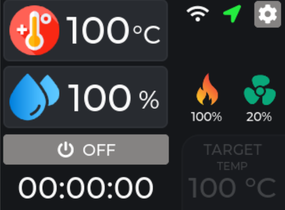
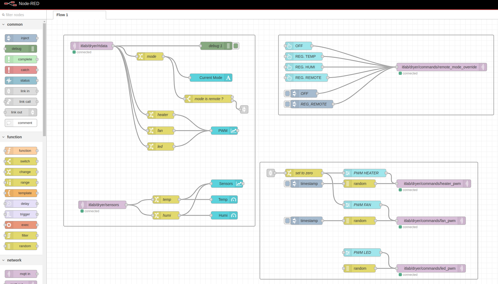
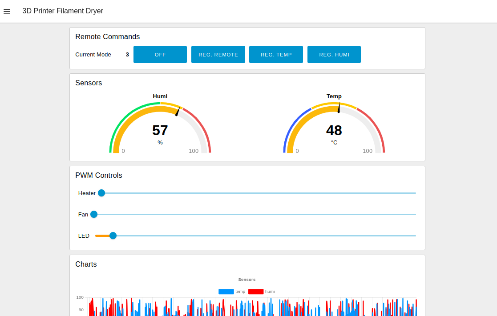

3D Printer Filament Dryer Controller  
=========================================

A project based on ESP32 & TFT TouchScreen to control heater for a DIY 3D Printer filament dryer.

For the UI  LVGL 9 and [EEZ-Studio](https://github.com/eez-open/studio) are used, with some automation done with EEZ-Flow.

The controller is connected to MQTT Broker via WiFi, to send sensors and actuators data and to permit also remote control.

Node-RED is used to intercat with MQTT data and commands.


## MQTT Topics

The {base_topic} is defined in the code: 
```
#define MQTT_BASE_TOPIC "itlab/dryer"
```

There are some topic used to send sensors values and other realtime data from board to the Broker:
- {base_topic}/reg_mode -> current regulation mode (0..3)
- {base_topic}/sensors -> json with sensors values: {temp: 23, humi: 60}
- {base_topic}/rtdata  -> json with realtime data values: {"mode":0,"target":0,"heater_pwm":0,"fan_pwm":0,"led_pwm":0,"remaining_time":0}


There are some topic the board use to receive remote commands from the Broker:
- {base_topic}/commands/remote_mode_override     (int) -> override the regulation mode (0:off, 1:temp, 2:humi, 3:remote)
- {base_topic}/commands/heater_pwm               (int) -> pwm out value (0/255) for heater
- {base_topic}/commands/fan_pwm                  (int) -> pwm out value (0/255) for fan
- {base_topic}/commands/led_pwm                  (int) -> pwm out value (0/255) for led


##  Libraries dependencies

The project uses the following libraries from PlatformIO registry :

- XPT2046_Touchscreen by Paul Stoffregen to use the Touchscreen - https://github.com/PaulStoffregen/XPT2046_Touchscreen 
- TFT_eSPI by Bodmer to use the TFT display - https://github.com/Bodmer/TFT_eSPI
- lvgl v9 by LVGL - https://github.com/lvgl/lvgl
- BME280_Light by Tomasz 'Zen' Napierala
- PicoMQTT - https://github.com/mlesniew/PicoMQTT
- PID_V1 - https://github.com/br3ttb/Arduino-PID-Library/

See the file `platformio.ini` for the lib_deps options listing used libs.


## Screenshots

#### LVGL GUI



#### Node-RED Flow & Dashboard


